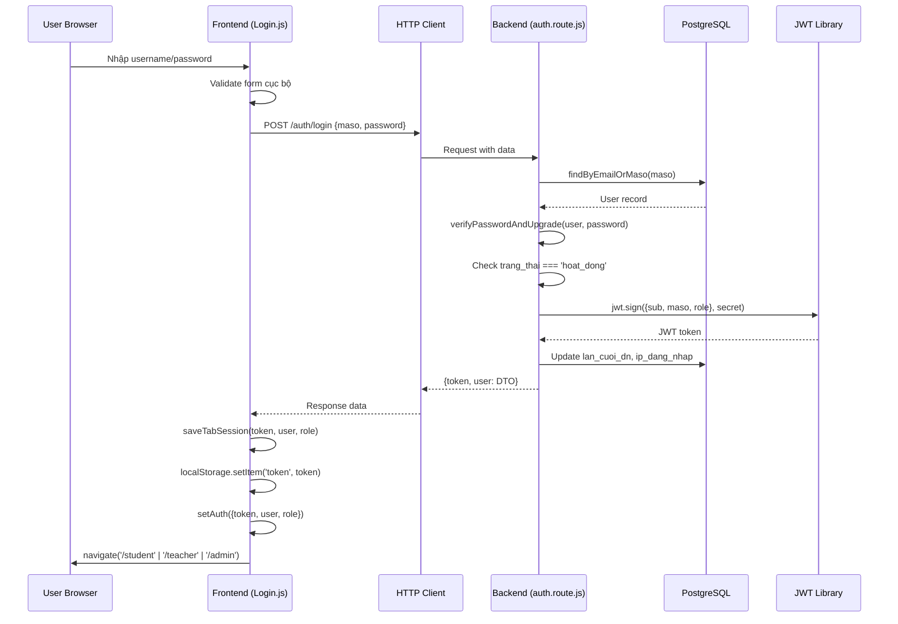
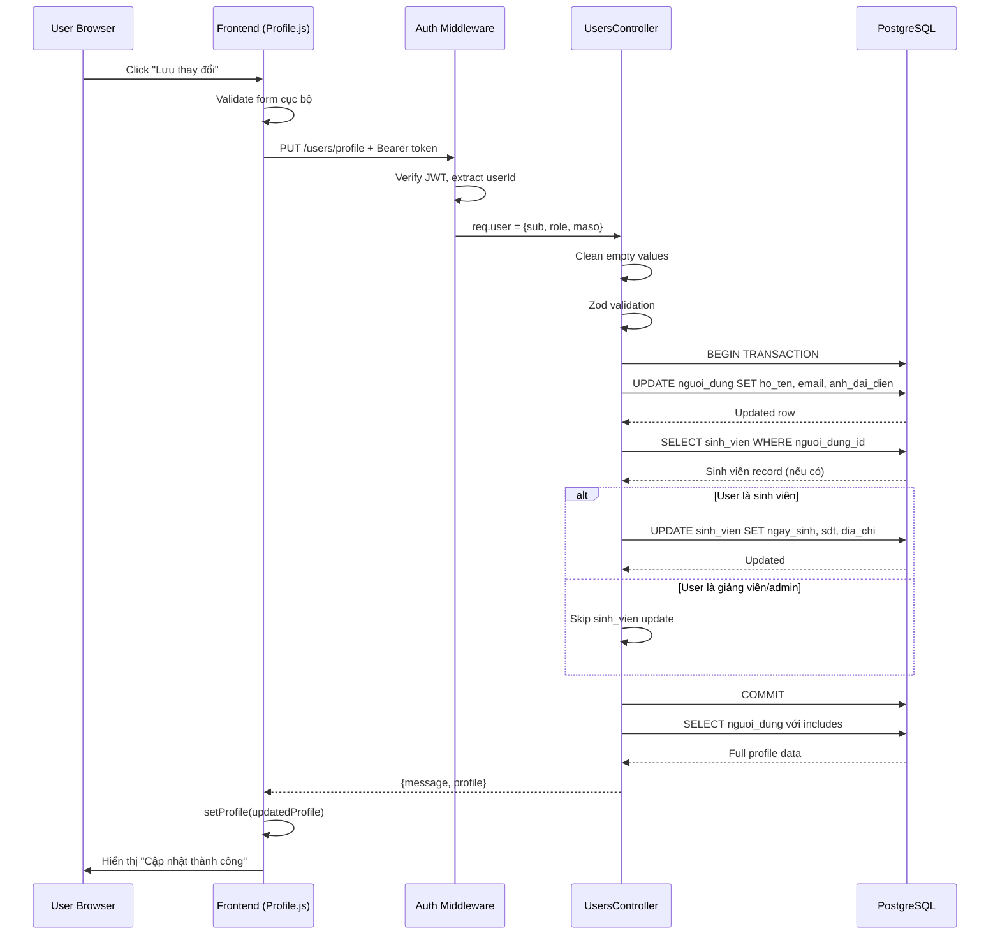

# Tài liệu Luồng Xử Lý Hệ Thống

## Tổng quan kiến trúc
- **Backend**: Node.js + Express + Prisma ORM (PostgreSQL)
- **Frontend**: React (SPA)
- **Authentication**: JWT Bearer Token
- **Authorization**: RBAC (Role-Based Access Control) với 4 vai trò chính

---

## I. LUỒNG ĐĂNG NHẬP (LOGIN FLOW)

### 1. Các vai trò hệ thống

| Vai trò | Mã trong DB | Quyền hạn chính |
|---------|-------------|-----------------|
| **Sinh viên** | `SINH_VIEN` hoặc `STUDENT` | Xem và đăng ký hoạt động, xem điểm rèn luyện cá nhân |
| **Lớp trưởng** | `LOP_TRUONG` | Quyền sinh viên + Tạo/quản lý hoạt động lớp, duyệt đăng ký sinh viên trong lớp |
| **Giảng viên** | `GIANG_VIEN` hoặc `TEACHER` | Tạo hoạt động, duyệt hoạt động và đăng ký của sinh viên thuộc các lớp chủ nhiệm |
| **Admin** | `ADMIN` | Toàn quyền quản trị hệ thống, quản lý người dùng, báo cáo, cấu hình |

### 2. File và code liên quan

#### Backend Files
```
backend/src/
├── routes/auth.route.js          # Endpoint login, register, profile
├── middlewares/auth.js           # JWT verification, role normalization
├── middlewares/rbac.js           # Permission checking middleware
├── models/auth.model.js          # Database queries cho auth
├── utils/validation.js           # Zod schemas: loginSchema, registerSchema
└── config/app.js                 # JWT secret, expiry config
```

#### Frontend Files
```
frontend/src/
├── pages/Login.js                # Login UI component
├── services/http.js              # Axios HTTP client wrapper
├── store/useAppStore.js          # Zustand state management (auth state)
├── contexts/TabSessionContext.js # Multi-tab session sync
└── utils/role.js                 # Role normalization helper
```

### 3. Flow chi tiết - ĐĂNG NHẬP

#### Bước 1: User nhập thông tin đăng nhập
**File**: `frontend/src/pages/Login.js`

```javascript
// Input form với validation cơ bản
const [formData, setFormData] = React.useState({ 
  username: '', 
  password: '', 
  remember: false 
});

// Validate form trước khi submit
function validateForm() {
  var newErrors = {};
  if (!formData.username) {
    newErrors.username = 'Vui lòng nhập tên đăng nhập hoặc email';
  }
  if (!formData.password) {
    newErrors.password = 'Vui lòng nhập mật khẩu';
  } else if (formData.password.length < 6) {
    newErrors.password = 'Mật khẩu phải có ít nhất 6 ký tự';
  }
  return Object.keys(newErrors).length === 0;
}
```

#### Bước 2: Frontend gửi request đến backend
**File**: `frontend/src/pages/Login.js`

```javascript
async function handleSubmit(e) {
  e.preventDefault();
  if (!validateForm()) return;
  
  // Clear cache cũ
  localStorage.removeItem('profile');
  localStorage.removeItem('tab_id_temp');
  
  // POST /auth/login
  const res = await http.post('/auth/login', { 
    maso: String(formData.username || '').trim(), 
    password: formData.password 
  });
  
  const data = res.data?.data || res.data;
  const token = data?.token;
  const user = data?.user;
  const role = normalizeRole(user?.role || user?.roleCode);
  
  // Lưu vào localStorage và state
  saveTabSession({ token, user, role });
  localStorage.setItem('token', token);
  localStorage.setItem('user', JSON.stringify(user));
  setAuth({ token, user, role });
  
  // Redirect theo role
  let target = '/';
  if (role === 'ADMIN') target = '/admin';
  else if (role === 'GIANG_VIEN') target = '/teacher';
  else if (role === 'LOP_TRUONG') target = '/monitor';
  else if (role === 'SINH_VIEN' || role === 'STUDENT') target = '/student';
  
  navigate(target);
}
```

#### Bước 3: Backend xử lý authentication
**File**: `backend/src/routes/auth.route.js`

```javascript
// POST /api/auth/login
router.post('/login', loginLimiter, validate(loginSchema), async (req, res) => {
  const { maso, password } = req.validatedData;
  
  // 1. Tìm user theo mã số (MSSV) hoặc email
  let user = await AuthModel.findByEmailOrMaso(maso);
  if (!user) {
    // Demo mode: tự động tạo demo users nếu DB trống
    await ensureDemoUsersIfNeeded();
    user = await AuthModel.findByEmailOrMaso(maso);
  }
  
  if (!user) {
    return sendResponse(res, 401, 
      ApiResponse.unauthorized('Mã số hoặc mật khẩu không đúng'));
  }
  
  // 2. Verify password (hỗ trợ cả bcrypt và argon2)
  const isPasswordValid = await AuthModel.verifyPasswordAndUpgrade(user, password);
  if (!isPasswordValid) {
    return sendResponse(res, 401, 
      ApiResponse.unauthorized('Mã số hoặc mật khẩu không đúng'));
  }
  
  // 3. Kiểm tra trạng thái tài khoản
  if (user.trang_thai !== 'hoat_dong') {
    return sendResponse(res, 401, 
      ApiResponse.unauthorized('Tài khoản đã bị khóa'));
  }
  
  // 4. Tạo JWT payload
  const payload = {
    sub: user.id,  // User ID
    maso: user.ten_dn,  // Username/MSSV
    role: (user.vaiTro?.ten_vt || user.vai_tro?.ten_vt || 'STUDENT').toUpperCase()
  };
  
  // 5. Sign JWT token
  const token = jwt.sign(payload, config.jwtSecret, { 
    expiresIn: config.jwtExpiresIn  // Mặc định: '7d'
  });
  
  // 6. Cập nhật thông tin đăng nhập (last login, IP)
  await AuthModel.capNhatThongTinDangNhap(user.id, req.ip);
  
  // 7. Log audit trail
  logInfo('LOGIN_SUCCESS', { 
    userId: user.id, 
    maso: user.ten_dn, 
    role: payload.role,
    ip: req.ip 
  });
  
  // 8. Trả về token và user DTO
  const dto = AuthModel.toUserDTO(user);
  sendResponse(res, 200, ApiResponse.success(
    { token, user: dto }, 
    'Đăng nhập thành công'
  ));
});
```

#### Bước 4: Middleware bảo vệ các route
**File**: `backend/src/middlewares/auth.js`

```javascript
// Middleware xác thực JWT cho các protected routes
const auth = async (req, res, next) => {
  try {
    // 1. Extract token từ header
    const header = req.headers.authorization || '';
    const token = header.startsWith('Bearer ') ? header.slice(7) : null;
    
    if (!token) {
      return sendResponse(res, 401, 
        ApiResponse.unauthorized('Token không được cung cấp'));
    }
    
    // 2. Verify JWT
    const decoded = jwt.verify(token, config.jwtSecret);
    
    // 3. Lấy role từ DB nếu không có trong token
    let role = decoded.role;
    if (!role) {
      const dbUser = await prisma.nguoiDung.findUnique({
        where: { id: decoded.sub },
        include: { vai_tro: true }
      });
      if (dbUser) {
        role = dbUser.vai_tro?.ten_vt || 'SINH_VIEN';
      }
    }
    
    // 4. Normalize role (xử lý các biến thể tiếng Việt)
    decoded.role = normalizeRole(role) || 'SINH_VIEN';
    
    // 5. Gán user vào request để các handler dùng
    req.user = decoded;
    
    return next();
  } catch (error) {
    if (error.name === 'TokenExpiredError') {
      return sendResponse(res, 401, 
        ApiResponse.unauthorized('Token đã hết hạn'));
    }
    if (error.name === 'JsonWebTokenError') {
      return sendResponse(res, 401, 
        ApiResponse.unauthorized('Token không hợp lệ'));
    }
    return sendResponse(res, 401, 
      ApiResponse.unauthorized('Token không hợp lệ hoặc đã hết hạn'));
  }
};

// Normalize role: map các biến thể tiếng Việt sang code chuẩn
const normalizeRole = (input) => {
  if (!input) return undefined;
  const upper = String(input).trim().toUpperCase();
  const noAccent = upper.normalize('NFD').replace(/\p{Diacritic}/gu, '');
  
  const map = {
    'ADMIN': 'ADMIN',
    'QUAN TRI VIEN': 'ADMIN',
    'GIANG VIEN': 'GIANG_VIEN',
    'SINH VIEN': 'SINH_VIEN',
    'LOP TRUONG': 'LOP_TRUONG'
  };
  
  return map[upper] || map[noAccent] || upper;
};

// Middleware kiểm tra quyền admin
const requireAdmin = (req, res, next) => {
  const role = normalizeRole(req.user?.role);
  if (role !== 'ADMIN') {
    return sendResponse(res, 403, 
      ApiResponse.forbidden('Chỉ admin mới có quyền truy cập'));
  }
  next();
};
```

### 4. Sequence Diagram - Login Flow



---

## II. LUỒNG CHỈNH SỬA THÔNG TIN CÁ NHÂN (PROFILE UPDATE)

### 1. File và code liên quan

#### Backend Files
```
backend/src/
├── routes/
│   ├── auth.route.js             # GET /auth/profile, PUT /auth/profile (deprecated)
│   └── users.route.js            # PUT /users/profile (recommended)
├── controllers/users.controller.js  # updateProfile logic
├── middlewares/
│   ├── auth.js                   # JWT auth
│   └── rbac.js                   # requirePermission('profile.update')
└── models/user.model.js          # DB operations
```

#### Frontend Files
```
frontend/src/
├── pages/Profile.js              # Sinh viên profile view
├── pages/teacher/TeacherProfile.js  # Giảng viên profile
├── pages/admin/AdminProfile.js   # Admin profile (nếu có)
├── services/http.js              # HTTP client
└── utils/avatarUtils.js          # Avatar upload helpers
```

### 2. Flow chi tiết - XEM THÔNG TIN

#### Bước 1: Frontend load profile từ API
**File**: `frontend/src/pages/Profile.js`

```javascript
React.useEffect(function load(){
  let mounted = true;
  
  // Endpoint mới (khuyến nghị)
  http.get('/users/profile')
    .then(function(res){
      if(!mounted) return; 
      const p = res.data?.data || res.data || null; 
      setProfile(p); 
    })
    .catch(function(){
      // Fallback sang endpoint cũ nếu API mới chưa sẵn
      http.get('/auth/profile')
        .then(function(res){
          if(!mounted) return; 
          const p = res.data?.data || null; 
          setProfile(p); 
        })
        .catch(function(){
          // Handle error
        });
    });
  
  return function(){ mounted = false; };
}, []);
```

#### Bước 2: Backend trả về profile data
**File**: `backend/src/controllers/users.controller.js`

```javascript
// GET /api/users/profile
async getProfile(req, res) {
  try {
    const userId = req.user.id || req.user.sub;
    
    // Lấy thông tin người dùng kèm relations
    const user = await prisma.nguoiDung.findUnique({
      where: { id: userId },
      include: {
        vai_tro: {
          select: {
            id: true,
            ten_vt: true,
            mo_ta: true
          }
        },
        sinh_vien: {
          include: {
            lop: {
              select: {
                id: true,
                ten_lop: true,
                khoa: true,
                nien_khoa: true
              }
            }
          }
        }
      }
    });
    
    if (!user) {
      return sendResponse(res, 404, 
        ApiResponse.notFound('Không tìm thấy thông tin người dùng'));
    }
    
    // Build response DTO
    const profile = {
      id: user.id,
      ten_dn: user.ten_dn,
      email: user.email,
      ho_ten: user.ho_ten,
      anh_dai_dien: user.anh_dai_dien,
      vai_tro: user.vai_tro?.ten_vt || '',
      trang_thai: user.trang_thai,
      lan_cuoi_dn: user.lan_cuoi_dn,
      ngay_tao: user.ngay_tao,
      // Thông tin sinh viên (nếu có)
      sinh_vien: user.sinh_vien ? {
        mssv: user.sinh_vien.mssv,
        ngay_sinh: user.sinh_vien.ngay_sinh,
        gt: user.sinh_vien.gt,
        dia_chi: user.sinh_vien.dia_chi,
        sdt: user.sinh_vien.sdt,
        email: user.sinh_vien.email,
        lop: user.sinh_vien.lop ? {
          id: user.sinh_vien.lop.id,
          ten_lop: user.sinh_vien.lop.ten_lop,
          khoa: user.sinh_vien.lop.khoa,
          nien_khoa: user.sinh_vien.lop.nien_khoa
        } : null
      } : null
    };
    
    return sendResponse(res, 200, 
      ApiResponse.success(profile, 'Lấy thông tin profile thành công'));
      
  } catch (err) {
    logError('Error fetching user profile:', err);
    return sendResponse(res, 500, 
      ApiResponse.error('Lỗi khi lấy thông tin profile'));
  }
}
```

### 3. Flow chi tiết - CẬP NHẬT THÔNG TIN

#### Bước 1: User chỉnh sửa form và submit
**File**: `frontend/src/pages/Profile.js` (hoặc component tương tự)

```javascript
// Component có form chỉnh sửa (ví dụ đơn giản)
const [editForm, setEditForm] = React.useState({
  ho_ten: '',
  email: '',
  ngay_sinh: '',
  sdt: '',
  dia_chi: ''
});

async function handleUpdateProfile(e) {
  e.preventDefault();
  
  try {
    // PUT /users/profile
    const res = await http.put('/users/profile', editForm);
    
    // Refresh profile data
    const updated = res.data?.data?.profile || null;
    setProfile(updated);
    
    setMessage('Cập nhật thành công');
  } catch (error) {
    setError(error?.response?.data?.message || 'Không thể cập nhật');
  }
}
```

#### Bước 2: Backend validate và update
**File**: `backend/src/controllers/users.controller.js`

```javascript
// PUT /api/users/profile
async updateProfile(req, res) {
  try {
    const userId = req.user.id || req.user.sub;
    const input = req.body || {};
    
    // 1. Clean empty strings/nulls
    const cleaned = Object.keys(input).reduce((acc, key) => {
      const value = input[key];
      if (value === '' || value === null) {
        return acc;
      }
      acc[key] = value;
      return acc;
    }, {});
    
    // 2. Validate với Zod schema
    const validatedData = updateProfileSchema.parse(cleaned);
    
    // 3. Tách dữ liệu cho 2 bảng
    const updateUserData = {};
    if (validatedData.ho_ten) updateUserData.ho_ten = validatedData.ho_ten;
    if (validatedData.email) updateUserData.email = validatedData.email;
    if (validatedData.anh_dai_dien) updateUserData.anh_dai_dien = validatedData.anh_dai_dien;
    
    const updateSinhVienData = {};
    if (validatedData.ngay_sinh) 
      updateSinhVienData.ngay_sinh = new Date(validatedData.ngay_sinh);
    if (validatedData.gt) updateSinhVienData.gt = validatedData.gt;
    if (validatedData.dia_chi) updateSinhVienData.dia_chi = validatedData.dia_chi;
    if (validatedData.sdt) updateSinhVienData.sdt = validatedData.sdt;
    
    // 4. Transaction update cả 2 bảng
    const result = await prisma.$transaction(async (tx) => {
      // Update nguoi_dung table
      let updatedUser = null;
      if (Object.keys(updateUserData).length > 0) {
        updatedUser = await tx.nguoiDung.update({
          where: { id: userId },
          data: updateUserData
        });
        logInfo('nguoi_dung updated', { 
          userId, 
          fields: Object.keys(updateUserData) 
        });
      }
      
      // Update sinh_vien table (nếu user là sinh viên)
      if (Object.keys(updateSinhVienData).length > 0) {
        const sinhVien = await tx.sinhVien.findUnique({
          where: { nguoi_dung_id: userId }
        });
        
        if (sinhVien) {
          await tx.sinhVien.update({
            where: { nguoi_dung_id: userId },
            data: updateSinhVienData
          });
          logInfo('sinh_vien updated', { 
            userId, 
            fields: Object.keys(updateSinhVienData) 
          });
        } else {
          // User không phải sinh viên (giảng viên/admin)
          // Chỉ cập nhật được nguoi_dung fields
          logInfo('User has no sinh_vien record (teacher/admin), skipping sinh_vien fields', 
            { userId, attemptedFields: Object.keys(updateSinhVienData) });
        }
      }
      
      return updatedUser;
    });
    
    // 5. Fetch lại profile đầy đủ
    const refreshed = await prisma.nguoiDung.findUnique({
      where: { id: userId },
      include: {
        sinh_vien: { include: { lop: true } },
        vai_tro: true
      }
    });
    
    logInfo('Profile updated successfully', { userId });
    
    return sendResponse(res, 200, ApiResponse.success(
      { message: 'Cập nhật thông tin thành công', profile: refreshed }
    ));
    
  } catch (err) {
    if (err instanceof z.ZodError) {
      return sendResponse(res, 400, 
        ApiResponse.validationError(err.errors, 'Dữ liệu không hợp lệ'));
    }
    logError('Error updating profile:', err);
    return sendResponse(res, 500, 
      ApiResponse.error('Lỗi khi cập nhật thông tin'));
  }
}
```

### 4. Validation Schema
**File**: `backend/src/controllers/users.controller.js`

```javascript
const updateProfileSchema = z.object({
  ho_ten: z.string().min(2, 'Họ tên phải có ít nhất 2 ký tự').optional(),
  email: z.string().email('Email không hợp lệ').optional(),
  anh_dai_dien: z.string()
    .refine((val) => {
      if (!val) return true; // Optional
      // Accept relative, data, or absolute URLs
      const isValidFormat = val.startsWith('/') || 
                           val.startsWith('http://') || 
                           val.startsWith('https://') || 
                           val.startsWith('data:');
      // Max 255 chars
      const isValidLength = val.length <= 255;
      return isValidFormat && isValidLength;
    }, 'URL ảnh đại diện không hợp lệ hoặc quá dài (tối đa 255 ký tự)')
    .optional(),
  // Thông tin sinh viên cơ bản
  ngay_sinh: z.string().optional(),
  gt: z.enum(['nam', 'nu', 'khac']).optional(),
  dia_chi: z.string().optional(),
  sdt: z.string()
    .min(10, 'Số điện thoại phải có ít nhất 10 ký tự')
    .max(11)
    .optional()
});
```

### 5. Sequence Diagram - Profile Update



---

## III. PHÂN QUYỀN VÀ RBAC

### 1. Cấu trúc permissions
**File**: `backend/src/config/permissions.js`

```javascript
// Quyền theo vai trò (Role-Based)
const ROLE_PERMISSIONS = {
  SINH_VIEN: [
    'profile.read',
    'profile.update',
    'activities.view',
    'registrations.register',
    'registrations.cancel'
  ],
  
  LOP_TRUONG: [
    // Kế thừa quyền sinh viên
    ...ROLE_PERMISSIONS.SINH_VIEN,
    // Quyền thêm của lớp trưởng
    'activities.create',
    'activities.update',
    'activities.delete',
    'registrations.approve',  // Duyệt đăng ký sinh viên lớp
    'registrations.reject',
    'class.reports.view'
  ],
  
  GIANG_VIEN: [
    'profile.read',
    'profile.update',
    'activities.view',
    'activities.create',
    'activities.update',
    'activities.approve',     // Duyệt hoạt động do sinh viên tạo
    'activities.reject',
    'registrations.approve',
    'registrations.reject',
    'reports.view',
    'reports.export',
    'class.manage'            // Quản lý lớp chủ nhiệm
  ],
  
  ADMIN: [
    '*'  // Full access
  ]
};
```

### 2. Middleware kiểm tra quyền
**File**: `backend/src/middlewares/rbac.js`

```javascript
const requirePermission = (permission) => {
  return (req, res, next) => {
    const role = String(req.user?.role || '').toUpperCase();
    
    // Admin có tất cả quyền
    if (role === 'ADMIN') {
      return next();
    }
    
    // Lấy danh sách quyền của role
    const userPermissions = ROLE_PERMISSIONS[role] || [];
    
    // Kiểm tra quyền cụ thể
    if (userPermissions.includes(permission)) {
      return next();
    }
    
    return sendResponse(res, 403, ApiResponse.forbidden(
      `Bạn không có quyền: ${permission}`
    ));
  };
};
```

### 3. Ví dụ sử dụng trong routes

```javascript
// Endpoint chỉ admin mới truy cập được
router.get('/admin/users', 
  auth, 
  requireAdmin, 
  AdminController.listUsers
);

// Endpoint yêu cầu quyền cụ thể
router.put('/users/profile', 
  auth, 
  requirePermission('profile.update'), 
  UsersController.updateProfile
);

// Endpoint nhiều quyền (hoặc admin)
router.post('/activities/:id/approve', 
  auth, 
  requirePermission('activities.approve'), 
  activitiesController.approve
);
```

---

## IV. SO SÁNH LUỒNG THEO VAI TRÒ

### 1. SINH VIÊN (STUDENT)

#### Quyền hạn
- ✅ Xem danh sách hoạt động đã duyệt
- ✅ Đăng ký tham gia hoạt động
- ✅ Hủy đăng ký (trước deadline)
- ✅ Xem điểm rèn luyện cá nhân
- ✅ Chỉnh sửa thông tin cá nhân (họ tên, SĐT, địa chỉ)
- ✅ Đổi mật khẩu
- ❌ Không tạo hoạt động
- ❌ Không duyệt đăng ký của người khác

#### Luồng chính
```
1. Login → /student/dashboard
2. Xem hoạt động → GET /api/activities?status=da_duyet
3. Đăng ký → POST /api/activities/:id/register
4. Xem profile → GET /api/users/profile
5. Cập nhật info → PUT /api/users/profile
6. Đổi mật khẩu → POST /api/auth/change
```

### 2. LỚP TRƯỞNG (CLASS MONITOR)

#### Quyền hạn
- ✅ Tất cả quyền của sinh viên
- ✅ Tạo hoạt động cho lớp (trạng thái `cho_duyet`)
- ✅ Chỉnh sửa hoạt động do mình tạo
- ✅ Xóa hoạt động (nếu chưa có đăng ký)
- ✅ Duyệt/từ chối đăng ký của sinh viên trong lớp
- ✅ Xem báo cáo hoạt động lớp
- ❌ Không duyệt hoạt động (cần giảng viên duyệt)

#### Luồng chính
```
1. Login → /monitor/dashboard
2. Tạo hoạt động → POST /api/activities (trang_thai: cho_duyet)
3. Chờ giảng viên duyệt
4. Duyệt đăng ký SV → POST /api/activities/registrations/:regId/approve
5. Xem báo cáo → GET /api/class/reports
```

### 3. GIẢNG VIÊN (TEACHER)

#### Quyền hạn
- ✅ Xem tất cả hoạt động của các lớp chủ nhiệm
- ✅ Tạo hoạt động (tự động `da_duyet`)
- ✅ Duyệt hoạt động do sinh viên/lớp trưởng tạo
- ✅ Duyệt/từ chối đăng ký sinh viên
- ✅ Xem báo cáo chi tiết theo lớp/sinh viên
- ✅ Export điểm rèn luyện
- ❌ Không quản lý toàn hệ thống (chỉ lớp mình chủ nhiệm)

#### Luồng chính
```
1. Login → /teacher/dashboard
2. Tạo hoạt động → POST /api/activities (trang_thai: da_duyet)
3. Duyệt hoạt động SV → POST /api/activities/:id/approve
4. Duyệt đăng ký → POST /api/activities/registrations/:regId/approve
5. Xem báo cáo → GET /api/teacher/reports?lopId=...
```

### 4. ADMIN

#### Quyền hạn
- ✅ Toàn quyền quản trị
- ✅ Quản lý người dùng (CRUD, reset password)
- ✅ Quản lý vai trò và quyền
- ✅ Xem tất cả báo cáo
- ✅ Cấu hình hệ thống
- ✅ Backup/restore database
- ✅ Xem audit logs

#### Luồng chính
```
1. Login → /admin/dashboard
2. Quản lý users → GET /api/admin/users
3. Reset mật khẩu → POST /api/auth/admin/reset
4. Quản lý hoạt động → GET/PUT/DELETE /api/admin/activities/:id
5. Báo cáo hệ thống → GET /api/admin/reports/system
```

---

## V. FILE STRUCTURE TỔNG HỢP

### Backend Structure
```
backend/src/
├── index.js                      # App entry point
├── config/
│   ├── app.js                    # Environment config
│   ├── database.js               # Prisma client
│   └── permissions.js            # RBAC permissions map
├── middlewares/
│   ├── auth.js                   # JWT authentication
│   ├── rbac.js                   # Permission checking
│   ├── cors.js                   # CORS config
│   ├── sanitize.js               # Input sanitization
│   └── semesterLock.middleware.js # Semester write lock
├── routes/
│   ├── index.js                  # Route aggregator
│   ├── auth.route.js             # Login, register, profile
│   ├── users.route.js            # User management
│   ├── activities.route.js       # Activities CRUD
│   ├── admin.route.js            # Admin endpoints
│   └── teacher.route.js          # Teacher endpoints
├── controllers/
│   ├── users.controller.js       # User business logic
│   ├── admin.controller.js       # Admin operations
│   └── upload.controller.js      # File upload handling
├── models/
│   ├── auth.model.js             # Auth queries
│   └── user.model.js             # User queries
├── services/
│   ├── semesterClosure.service.js # Semester lock logic
│   └── auto-point-calculation.service.js # Point calc scheduler
├── utils/
│   ├── validation.js             # Zod schemas
│   ├── response.js               # API response helpers
│   └── logger.js                 # Winston logger
└── prisma/
    └── schema.prisma             # Database schema
```

### Frontend Structure
```
frontend/src/
├── index.js                      # React entry
├── App.js                        # Router setup
├── pages/
│   ├── Login.js                  # Login page
│   ├── Profile.js                # Student profile
│   ├── Register.js               # Registration
│   ├── student/
│   │   ├── Dashboard.js
│   │   └── Activities.js
│   ├── monitor/
│   │   ├── Dashboard.js
│   │   ├── ClassActivities.js
│   │   └── Approvals.js
│   ├── teacher/
│   │   ├── Dashboard.js
│   │   ├── TeacherProfile.js
│   │   └── Reports.js
│   └── admin/
│       ├── Dashboard.js
│       ├── Users.js
│       └── SystemConfig.js
├── components/
│   ├── Header.js
│   ├── StudentSidebar.js
│   └── ProtectedRoute.js        # Auth guard
├── services/
│   ├── http.js                   # Axios client + interceptors
│   ├── authService.js            # Auth helpers
│   └── sessionStorageManager.js  # Session sync
├── store/
│   └── useAppStore.js            # Zustand global state
├── contexts/
│   └── TabSessionContext.js      # Multi-tab session
├── hooks/
│   ├── useAuth.js                # Auth hook
│   └── useSemesterOptions.js     # Semester dropdown
└── utils/
    ├── role.js                   # Role normalization
    └── avatarUtils.js            # Avatar handling
```

---

## VI. API ENDPOINTS SUMMARY

### Authentication & Profile
| Method | Endpoint | Auth | Permission | Mô tả |
|--------|----------|------|------------|-------|
| POST | `/api/auth/login` | ❌ | Public | Đăng nhập |
| POST | `/api/auth/register` | ❌ | Public | Đăng ký tài khoản |
| POST | `/api/auth/logout` | ✅ | - | Đăng xuất |
| GET | `/api/auth/profile` | ✅ | `profile.read` | Xem profile (deprecated) |
| PUT | `/api/auth/profile` | ✅ | `profile.update` | Cập nhật profile (deprecated) |
| POST | `/api/auth/change` | ✅ | - | Đổi mật khẩu |
| GET | `/api/users/profile` | ✅ | `profile.read` | Xem profile (mới) |
| PUT | `/api/users/profile` | ✅ | `profile.update` | Cập nhật profile (mới) |

### Activities (Hoạt động)
| Method | Endpoint | Auth | Permission | Mô tả |
|--------|----------|------|------------|-------|
| GET | `/api/activities` | ✅ | `activities.view` | Danh sách hoạt động (có filter) |
| GET | `/api/activities/:id` | ✅ | `activities.view` | Chi tiết hoạt động |
| POST | `/api/activities` | ✅ | `activities.create` | Tạo hoạt động |
| PUT | `/api/activities/:id` | ✅ | `activities.update` | Cập nhật hoạt động |
| DELETE | `/api/activities/:id` | ✅ | `activities.delete` | Xóa hoạt động |
| POST | `/api/activities/:id/register` | ✅ | `registrations.register` | Đăng ký tham gia |
| POST | `/api/activities/:id/cancel` | ✅ | `registrations.cancel` | Hủy đăng ký |
| POST | `/api/activities/:id/approve` | ✅ | `activities.approve` | Duyệt hoạt động (GV) |
| POST | `/api/activities/:id/reject` | ✅ | `activities.reject` | Từ chối hoạt động (GV) |

### Registrations (Đăng ký)
| Method | Endpoint | Auth | Permission | Mô tả |
|--------|----------|------|------------|-------|
| POST | `/api/activities/registrations/:regId/approve` | ✅ | `registrations.approve` | Duyệt đăng ký (LT/GV) |
| POST | `/api/activities/registrations/:regId/reject` | ✅ | `registrations.reject` | Từ chối đăng ký |

### Admin
| Method | Endpoint | Auth | Permission | Mô tả |
|--------|----------|------|------------|-------|
| GET | `/api/admin/users` | ✅ | Admin | Danh sách users |
| POST | `/api/admin/users` | ✅ | Admin | Tạo user |
| PUT | `/api/admin/users/:id` | ✅ | Admin | Cập nhật user |
| DELETE | `/api/admin/users/:id` | ✅ | Admin | Xóa user |
| POST | `/api/auth/admin/reset` | ✅ | Admin | Reset mật khẩu user |

---

## VII. BEST PRACTICES & SECURITY

### 1. Authentication
- JWT token có expiry (mặc định 7 ngày)
- Token lưu trong localStorage và sessionStorage (multi-tab sync)
- Middleware `auth` verify token ở mọi protected route
- Hỗ trợ token refresh (nếu implement)

### 2. Authorization
- RBAC (Role-Based Access Control) chặt chẽ
- Mỗi endpoint có permission check
- Admin bypass mọi permission
- Log audit trail cho các thao tác quan trọng

### 3. Input Validation
- Zod schema cho mọi input
- Global sanitize middleware (XSS protection)
- Array handling được fix để không mất dữ liệu

### 4. Security Headers
- Helmet.js config
- CORS whitelist (development: allow all, production: config CORS_ORIGIN)
- CORP/COEP/CSP headers cho static files

### 5. Error Handling
- Global error middleware
- Không expose stack trace ở production
- Friendly error messages cho user
- Detailed logs cho debug

---

## VIII. TROUBLESHOOTING GUIDE

### Vấn đề 1: Login thành công nhưng redirect sai role
**Nguyên nhân**: Role không được normalize đúng
**Giải pháp**:
```javascript
// Kiểm tra normalizeRole trong auth.js
const role = normalizeRole(user?.role || user?.roleCode);
console.log('Normalized role:', role);
```

### Vấn đề 2: Token hết hạn liên tục
**Nguyên nhân**: JWT_EXPIRES_IN quá ngắn hoặc clock skew
**Giải pháp**:
```bash
# Trong backend/.env
JWT_EXPIRES_IN=7d  # Tăng thời gian
```

### Vấn đề 3: Profile update không lưu
**Nguyên nhân**: 
- Sanitize middleware biến array thành object (đã fix)
- Validation schema reject giá trị
**Giải pháp**:
```javascript
// Kiểm tra Zod schema
console.log('Validated data:', validatedData);
```

### Vấn đề 4: 403 Forbidden khi truy cập endpoint
**Nguyên nhân**: Thiếu permission hoặc role sai
**Giải pháp**:
```javascript
// Kiểm tra req.user trong middleware
console.log('User:', req.user);
console.log('Required permission:', permission);
console.log('User permissions:', ROLE_PERMISSIONS[req.user.role]);
```

---

## IX. TESTING

### Manual Testing Checklist

#### Login Flow
- [ ] Login với MSSV hợp lệ
- [ ] Login với email hợp lệ
- [ ] Login thất bại (sai mật khẩu)
- [ ] Login thất bại (tài khoản khóa)
- [ ] Redirect đúng theo role
- [ ] Token được lưu localStorage

#### Profile Update
- [ ] Xem profile hiển thị đầy đủ
- [ ] Cập nhật họ tên
- [ ] Cập nhật email (unique)
- [ ] Cập nhật SĐT, địa chỉ
- [ ] Upload avatar
- [ ] Đổi mật khẩu thành công
- [ ] Validation errors hiển thị đúng

#### Role-specific
- [ ] Sinh viên: Đăng ký hoạt động
- [ ] Sinh viên: Hủy đăng ký
- [ ] Lớp trưởng: Tạo hoạt động
- [ ] Lớp trưởng: Duyệt đăng ký SV
- [ ] Giảng viên: Duyệt hoạt động
- [ ] Admin: Quản lý users

---

## X. CONTACTS & SUPPORT

### Development Team
- **Backend Lead**: [Tên]
- **Frontend Lead**: [Tên]
- **DevOps**: [Tên]

### Documentation Updates
- Last updated: 2025-11-03
- Version: 1.0
- Maintained by: Development Team

---

**END OF DOCUMENTATION**
