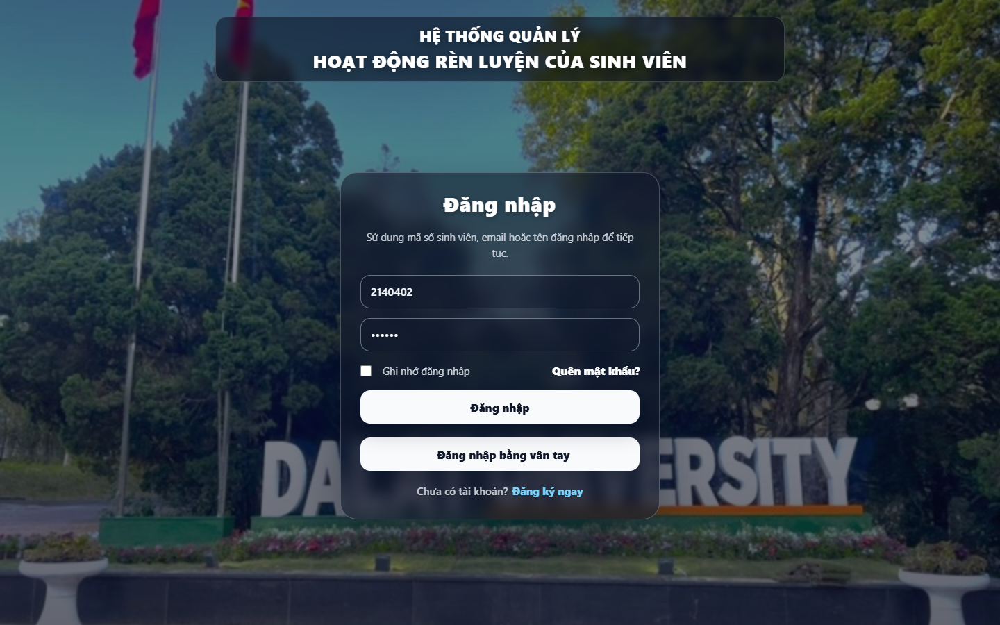
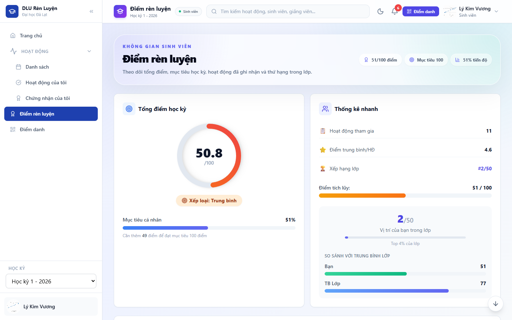
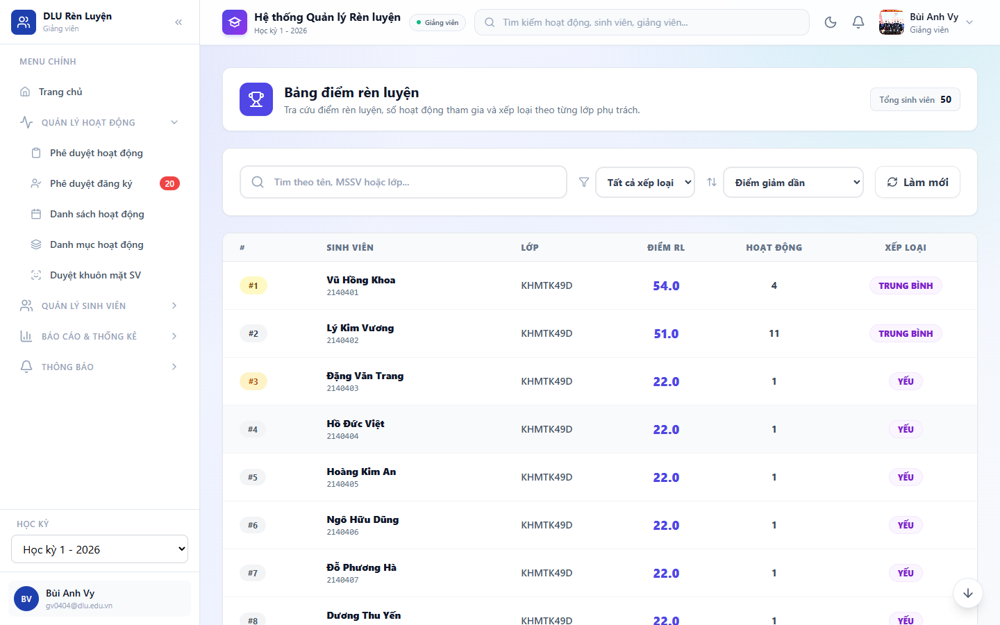

# Hệ thống Quản lý Hoạt động Rèn luyện Sinh viên

Ứng dụng web hỗ trợ Trường Đại học Đà Lạt quản lý hoạt động rèn luyện theo học kỳ: tạo và duyệt hoạt động, đăng ký tham gia, điểm danh QR/khuôn mặt, tính điểm rèn luyện, thống kê báo cáo và quản lý sinh viên theo lớp.

## Giao diện

### Đăng nhập


### Sinh viên theo dõi điểm rèn luyện





### Giảng viên quản lý điểm sinh viên



## Chức năng chính

| Vai trò | Chức năng |
| --- | --- |
| Quản trị viên | Quản lý người dùng, vai trò, lớp, loại hoạt động, học kỳ, duyệt hoạt động, báo cáo toàn hệ thống |
| Giảng viên | Quản lý lớp phụ trách, tạo hoạt động, duyệt đăng ký, duyệt khuôn mặt sinh viên, xem điểm và báo cáo theo học kỳ |
| Lớp trưởng | Quản lý hoạt động lớp, hỗ trợ điểm danh, theo dõi sinh viên trong lớp, xử lý đăng ký theo phạm vi được phân quyền |
| Sinh viên | Xem danh sách hoạt động, đăng ký tham gia, điểm danh nhanh, xem chứng nhận và điểm rèn luyện theo học kỳ |

## Kiến trúc

| Thành phần | Công nghệ |
| --- | --- |
| Frontend | React 19, React Router, Zustand, Tailwind CSS, Recharts, Playwright |
| Backend API | Node.js, Express 5, TypeScript, Prisma ORM, JWT, Zod |
| Database | PostgreSQL 15 |
| Nhận diện khuôn mặt | Python FastAPI, DeepFace/RetinaFace/ArcFace |
| Hạ tầng local | Docker Compose, Nginx, Prisma Studio, Dozzle |

Luồng chính của hệ thống:

1. Frontend gọi API qua `/api`.
2. Backend xác thực JWT, áp dụng phân quyền theo vai trò và phạm vi lớp/học kỳ.
3. Prisma truy vấn PostgreSQL cho hoạt động, đăng ký, điểm danh, điểm rèn luyện và báo cáo.
4. Dịch vụ nhận diện khuôn mặt xử lý đăng ký/điểm danh khuôn mặt và trả kết quả cho backend.

## Cấu trúc thư mục

```text
.
├── backend/                  # Express API, Prisma schema, business modules
├── frontend/                 # React SPA
├── face-recognition-service/ # FastAPI service nhận diện khuôn mặt
├── nginx/                    # Cấu hình reverse proxy
├── docs/                     # Tài liệu và ảnh README
└── docker-compose.yml        # Môi trường dev/prod bằng Docker
```

## Yêu cầu môi trường

- Docker Desktop
- Node.js 22 hoặc mới hơn nếu chạy ngoài Docker
- npm
- Git

## Chạy hệ thống bằng Docker Compose

Tạo file `.env` ở thư mục gốc nếu chưa có:

```env
JWT_SECRET=devops-demo-secret-key-for-development-2026
FACE_SERVICE_TOKEN=dev-face-service-token
```

Khởi động môi trường phát triển:

```powershell
docker compose --profile dev up -d --build db backend-dev frontend-dev face-recognition
```

Kiểm tra trạng thái:

```powershell
docker compose ps
```

Các địa chỉ thường dùng:

| Dịch vụ | URL |
| --- | --- |
| Web app | http://localhost:3000 |
| Backend API | http://localhost:3001 |
| Health check | http://localhost:3001/api/v1/health |
| Face recognition | http://localhost:5000/health |
| Prisma Studio | http://localhost:5555 |
| Log viewer | http://localhost:9999 |

Nếu database mới chưa có dữ liệu mẫu:

```powershell
docker exec dacn_backend_dev npm run seed
```

## Tài khoản mẫu

| Vai trò | Tài khoản | Mật khẩu |
| --- | --- | --- |
| Quản trị viên | `admin` hoặc `Admin` | `123456` |
| Giảng viên | `gv0404` | `123456` |
| Lớp trưởng | `2140401` | `123456` |
| Sinh viên | `2140402` | `123456` |

## Hướng dẫn sử dụng

Xem tài liệu hướng dẫn thao tác theo từng vai trò tại [docs/HUONG_DAN_SU_DUNG_WEBSITE.md](docs/HUONG_DAN_SU_DUNG_WEBSITE.md).

## Lệnh phát triển

Backend:

```powershell
cd backend
npm run build
```

Frontend:

```powershell
cd frontend
npm run build
```

Xem log container:

```powershell
docker compose logs -f backend-dev frontend-dev
```

## Ghi chú dữ liệu điểm rèn luyện

Điểm rèn luyện được tính theo học kỳ và gom từ hoạt động đã tham gia. Backend ưu tiên trạng thái đăng ký `da_tham_gia`, đồng thời có fallback từ bản ghi điểm danh đã xác nhận để tránh lệch điểm khi dữ liệu đăng ký và điểm danh chưa đồng bộ.

## Nhóm thực hiện

| MSSV | Họ tên | Email |
| --- | --- | --- |
| 2212377 | Trần Ngọc Hưng | 2212377@dlu.edu.vn |
| 2212391 | Nguyễn Hoàng Nam Khánh | 2212391@dlu.edu.vn |
| 2212410 | Trần Vũ Thành Luân | 2212410@dlu.edu.vn |
